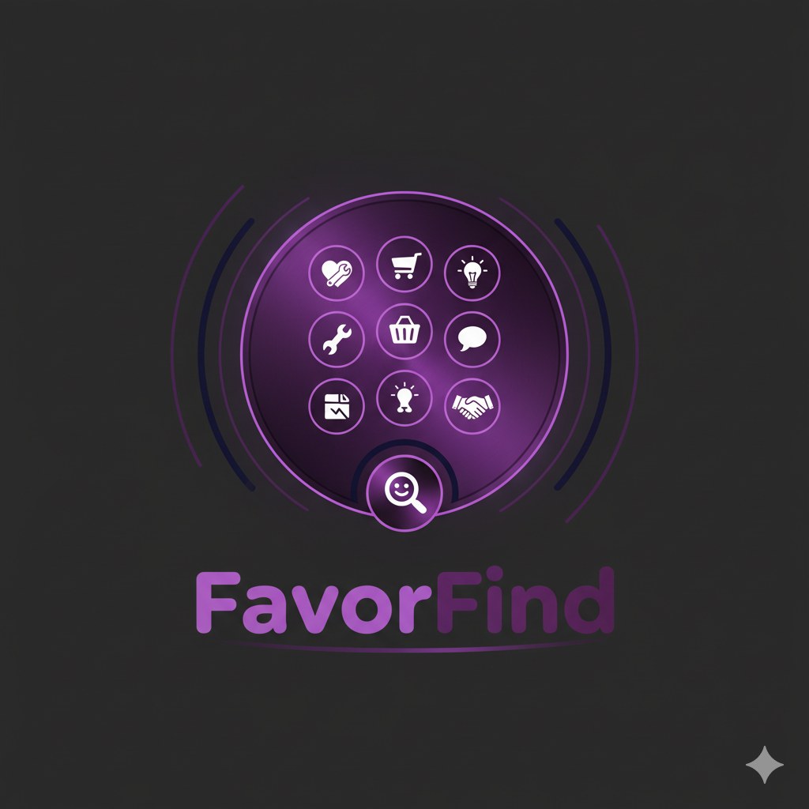

<div align="center">
  
  
  # FavorFind
  
  ### The Ultimate Directory of the Best Things on the Internet
  
  [](https://astro.build)
  [](https://bun.sh)
  [](https://react.dev)
  
</div>

---

## 🎯 Overview

FavorFind is an intelligent knowledge discovery platform that helps you find the best resources on the internet through an innovative **dynamic dialpad interface**. Instead of traditional search, FavorFind guides you through a multi-step selection process to pinpoint exactly what you're looking for.

## ✨ Key Features

### 🎨 Dynamic Dialpad Navigation
- **3-Step Guided Search**: Navigate through Buy, Learn, Guide, Social, News, and Lookup categories
- **Smart Categorization**: AI-powered third-level menu generation using Gemini
- **Icon-Based Interface**: Beautiful Lucide React icons for intuitive navigation

### 🔍 Intelligent Search
- **Multiple Search Providers**: Perplexity AI, Gemini, and Semantic Scholar integration
- **Smart Caching**: SQLite-based caching for lightning-fast repeat searches
- **Advanced Filters**: Content type, source type, date, and relevance sorting

### 📚 Personal Library
- **Save & Organize**: Keep track of your favorite resources
- **Persistent Storage**: Local storage for instant access across sessions
- **Quick Access**: View your saved items anytime

### 🎨 Modern UI/UX
- **Responsive Design**: Works seamlessly on desktop, tablet, and mobile
- **Dark Theme**: Eye-friendly interface for extended browsing
- **Smooth Animations**: Polished interactions with loading states

## 🛠️ Tech Stack

- **Framework**: [Astro](https://astro.build) - The web framework for content-driven websites
- **Runtime**: [Bun](https://bun.sh) - Fast all-in-one JavaScript runtime
- **Frontend**: [React 19](https://react.dev) - UI components with hooks
- **Styling**: [Tailwind CSS](https://tailwindcss.com) - Utility-first CSS framework
- **Icons**: [Lucide React](https://lucide.dev) - Beautiful & consistent icons
- **AI**: [Google Gemini](https://ai.google.dev) - Dynamic menu generation
- **Search**: [Perplexity AI](https://www.perplexity.ai) - Intelligent search results
- **Database**: SQLite (via Bun) - Local caching and storage

## 🚀 Getting Started

### Prerequisites

- [Bun](https://bun.sh) >= 1.0.0
- Node.js >= 18.0.0 (optional, for compatibility)

### Installation

1. **Clone the repository**
   ```bash
   git clone https://github.com/jadbox/favorfind.git
   cd favorfind
   ```

2. **Install dependencies**
   ```bash
   bun install
   ```

3. **Set up environment variables**
   
   Create a `.env` file in the root directory:
   ```env
   GEMINI_API_KEY=your_gemini_api_key_here
   PERPLEXITY_API_KEY=your_perplexity_api_key_here
   SEMANTIC_SCHOLAR_API=your_semantic_scholar_api_key_here
   ```

4. **Start the development server**
   ```bash
   bun run dev
   ```

5. **Open your browser**
   
   Navigate to `http://localhost:4322`

## 🔑 API Keys

### Gemini API (Required)
- **Purpose**: Dynamic menu generation for the dialpad's third level
- **Get Your Key**: [Google AI Studio](https://makersuite.google.com/app/apikey)

### Perplexity AI (Required)
- **Purpose**: Main search functionality
- **Get Your Key**: [Perplexity API](https://www.perplexity.ai)

### Semantic Scholar (Optional)
- **Purpose**: Academic paper search
- **Get Your Key**: [Semantic Scholar API](https://api.semanticscholar.org/api-docs/)

## 📖 Usage

### Using the Dialpad

1. **Select a Category**: Choose from Buy, Learn, Guide, Social, News, or Lookup & Forecast
2. **Pick a Subcategory**: Drill down into specific topics
3. **Choose Specifics**: AI generates relevant options based on your selections
4. **View Results**: Get curated search results matching your exact needs

### Filtering Results

Refine your search results with filters on the results page.

### Saving to Library

Click the bookmark icon on any result to save it to your personal library for later reference.

## 🏗️ Project Structure

```
favorfind/
├── public/
│   └── images/          # Static assets including logo
├── src/
│   ├── components/      # React components
│   │   ├── Dialer.tsx   # Dynamic dialpad component
│   │   ├── SearchResultsFilters.tsx
│   │   └── ...
│   ├── config/          # Configuration files
│   │   ├── dialerConfig.ts
│   │   └── filterConfig.ts
│   ├── layouts/         # Astro layouts
│   ├── pages/           # Astro pages & API routes
│   │   ├── api/
│   │   │   ├── dialer/  # Dialpad API endpoints
│   │   │   └── search.ts
│   │   └── index.astro
│   ├── services/        # Data providers & services
│   │   ├── cache.ts     # SQLite caching
│   │   ├── geminiDataProvider.ts
│   │   └── perplexityDataProvider.ts
│   └── utils/           # Utility functions
└── plans/               # Project documentation
```

## 🧪 Development

### Build for Production

```bash
bun run build
```

### Preview Production Build

```bash
bun run preview
```

### Run with Bun

```bash
bun start
```

## 🤝 Contributing

Contributions are welcome! Please feel free to submit a Pull Request.

## 📄 License

This project is licensed under the MIT License.

## 🙏 Acknowledgments

- Built with [Astro](https://astro.build)
- Powered by [Bun](https://bun.sh)
- AI by [Google Gemini](https://ai.google.dev)
- Search by [Perplexity AI](https://www.perplexity.ai)
- Icons by [Lucide](https://lucide.dev)

---

<div align="center">
  Made with ❤️ for the internet by Jonathan Dunlap https://www.linkedin.com/in/jonathandunlap/
</div>
